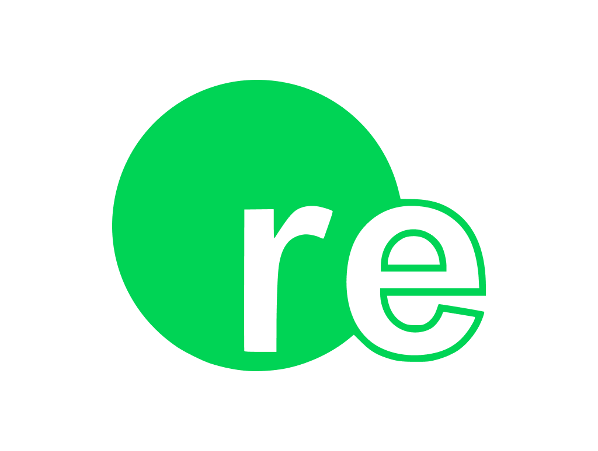

# Re - a modern build system for the future

**Re** is a project aiming to create what C++ hasn't ever had - a lightweight, easy-to-use build system that lets you focus on writing code and not on writing build scripts. **Check out our [examples folder](/examples) to see it for yourself!**

Some of Re's notable features are:

- **No code:** Re explicitly does NOT allow you to imperatively write build logic on your own. The entire build process is governed by simple, declarative YAML configs. This simplifies the project structure a lot, even if it sacrifices some use cases and in some cases forces you to restructure your project a bit.
- **Trivial setup:** the simplest Re project is literally [just two lines of configuration](/examples/hello-world/re.yml).
- **Easy dependencies:** Re provides a unified interface for dependencies in the config file and supports Git, GitHub and [vcpkg](https://github.com/microsoft/vcpkg) dependencies out of the box. [See for yourself how easy it is!](/examples/easy-dependencies)
- **Custom actions:** Re supports custom build actions that are run on pre-build/post-build stages or when you trigger them using a `re do <category>` command. [Check them out!](/examples/actions-showcase)
- **Cross-platform support:** Re projects build the same way on **Windows**, **Linux** and **macOS**. If you haven't used any platform-specific features, your project will always get built just fine via invoking `re` on all three platforms.
- **Self-build support:** Re is built using, you guessed it, Re. An old version of Re using CMake is used to "bootstrap" the build if Re isn't already available. As Re is quite extensive, its capability to build itself proves its capabilities.

**WARNING:** Re is still under development, and problems may very well arise. Please [create an issue](https://github.com/osdeverr/rebs/issues/new) if something goes wrong or [create a pull request](https://github.com/osdeverr/rebs/pulls) if you wanna make something right.

## So why Re?

### It just works

Building Re projects doesn’t require you to configure them, write build scripts or really do anything else — just type in “re” in your command line and you’re all set!

### It likes company

Re integrates with Microsoft's [vcpkg](https://github.com/microsoft/vcpkg) package manager, allowing you to access tons of useful packages from the get-go. No special setup needed - it's available out of the box!

As well as that, Re supports first-class C++ development inside of Visual Studio Code with the help of one tiny plugin, making your development experience comfortable from the get-go.

### It's not stupid

Re automatically gathers the source tree for every project you build, allowing you to focus on the actual important part of software development - *writing code.*

### It's quite fast

Despite its extensive features, Re does not struggle to perform and does its job at an acceptable speed. *(TODO: performance comparisons!)*

## How does Re work?

You define your project by creating a YAML file named `re.yml`. This file defines everything that's needed to build your code: build options, dependencies, actions, you name it.

### Example Project

#### `re.yml`
```yaml
type: executable
name: hello-world

deps:
    - vcpkg:fmt
```

#### `main.cpp`
```cpp
#include <fmt/format.h>

int main()
{
    fmt::print("Hello World from Re!\n");
}
```

#### **Build Instructions**
Create the above-described files in a separate directory and run `re`. Yes, that's it.

**NOTE:** If you're running Windows, you will have to run Re commands inside of a Visual Studio Developer Command Prompt

**TIP:** Re provides an easy way to create a bare-bones `re.yml` using the `re new <type> <path>` command-line syntax!

## Goals
1. Create an awesome C++ build system.
2. See Goal #1.

## Non-goals
Some of 

## TODO

Unfortunately, Re is not yet a finished project. Some notable features are still missing, namely:

1. Out-of-the-box debugging support for VS Code
2. 
